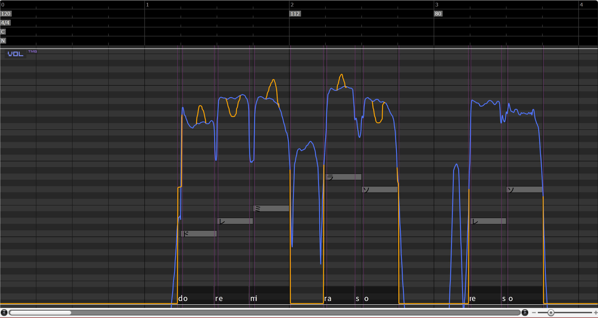
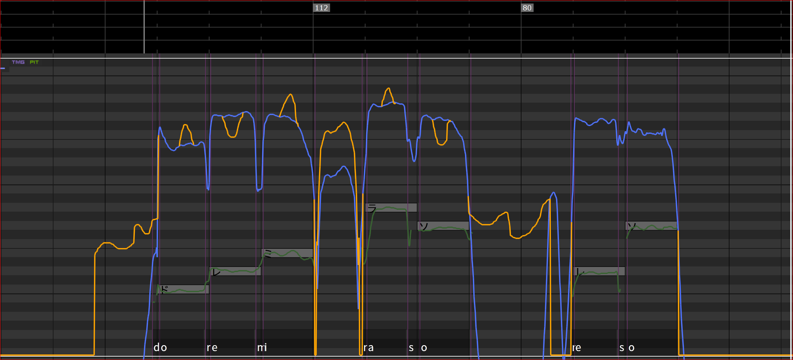

# SasaraUtil

	

**[SasaraUtil](https://github.com/InuInu2022/SasaraUtil)**（ささらユーティル）はCeVIOエディタのあれこれを使いやすくする補助ツールです。

---

  
  
  

## 最新版ダウンロード / Download latest

- **[Download SasaraUtil](https://github.com/InuInu2022/SasaraUtil/releases/latest)**

- ダウンロード方法
  - 上から一番新しい物を選んでzipファイルをダウンロードして展開して使ってください
  - アップデートはそのまま上書きしてください
  - アンインストールは解凍したフォルダをまるごと消してください
- [ニコニ・コモンズ nc29686](https://commons.nicovideo.jp/material/nc296868)
  - ニコニコ動画等で投稿する作品で使用した場合、利用登録してくださるとうれしいです
  - ※登録は必須ではありません

## 機能 / Functions

> 
> ver.0.1

- 共通向け
  - [オーディオトラック変換](#オーディオトラック変換)
- CeVIOトーク向け
  - [キャストを別トラック振り分け](#キャストを別トラック振り分け)
  - [ボイパロイド](#ボイパロイド)
  - _coming soon_
- CeVIOソング向け
  - [ブレス削除・抑制](#ブレス削除抑制)
  - _coming soon_

---

### 共通機能

#### オーディオトラック変換

 

CeVIOのオーディオ取込は16bit/48kHzのwav形式の制限があります。これに対応した形式に自動で変換します。

詳細

##### ファイル形式変換

SasaraUtilの「**オーディオトラック変換**」にファイルをドラッグ＆ドロップすると、対応している音声ファイルを自動で**16bit/48kHzのwav形式**に変換します。

動画ファイルも音声ファイルに変換できます。

- [対応形式](https://learn.microsoft.com/ja-jp/windows/win32/medfound/supported-media-formats-in-media-foundation?redirectedfrom=MSDN)
  - 音声ファイル (wav, mp3, aiff, etc...)
  - 動画ファイル（mp4, etc...）

複数ファイルの同時変換に対応しています。

「**Save**」ボタンを押すと、保存先を選ぶダイアログが開き、
変換されたファイルは、
`【元のファイル名】.16bit48khz.wav`
という名前で保存されます。

##### CeVIO取込機能

「**Send**」ボタンを押すことでCeVIOエディタにオーディオトラックとして変換済みの音声ファイルを自動で取り込みます。

- ※ 変換済みの音声ファイルは元のファイルの隣に作られます。
- ※ `.ccst` ファイルがCeVIOのエディタに関連付けられている必要があります
- ※この機能は1ファイルのみ対応です。

なお、オーディオの開始秒数は事前に設定できます。

---

### トーク向け機能

#### キャストを別トラック振り分け

 

通常、ひとつのトークトラックには複数のキャストが記録されます。

これをキャストごとに別々のトラックに振り分けようとすると手作業が大変ですが、この「**キャストを別トラック振り分け**」機能を使うと自動で振り分けられます。

|振り分け前|振り分け後|
|---------|---------|
|||

※CeVIOのトラックは32トラックが最大のため、合計で32トラック以上になる場合は何が起きるかわかりません。。。

#### ボイパロイド

 

トークボイスでボイスパーカッション（ボイパロイド）をする機能です。（実験的機能）

CeVIOのソングトラックのノートのデータを元に、トークトラックを生成し、ノートのタイミングに合わせてセリフを並べます。

- 歌わせるようではなく、**ボイスパーカッション用**です
- 1つのノートに対し、1つのトークの台詞を作成します
- 台詞はノートの歌詞を元につくられます。
  - 1ノート、日本語で200文字までOK（CeVIO AIの場合）
- 台詞の音程の中央値は元のノートに合うよう自動で調整されます
- 平坦なピッチにはなりません（現在はわざとそうしてます）
- 現在、発音の開始タイミングがノートの開始タイミングに合う様になっています。
  - 母音のタイミングではないのでやや遅れて聞こえる場合があります。

※大量のセリフが生成されるため、 **特にCeVIO AIで読み込むと非常に動作が重くなります**。 トラック毎に処理をすることをおすすめします。

CeVIOのソングエディタをお持ちでない場合や元の楽譜データがMIDI形式などccs/ccstでない場合は次の方法があります。

1. [Utaformatix](https://sdercolin.github.io/utaformatix3/)でCeVIOのソング形式に変換する
   - midiやust等がある場合はこちらがオススメです
   - ただし、1ノートに複数歌詞を入れられないソフトが多いためボイパ向けではありません
2. 無料の[VoiSona](https://voisona.com/)で打ち込んでccs/ccst形式でエクスポートする
   - VoiSonaはCeVIOソングの姉妹ソフトで、エディタと標準音源が無料です

---

### ソング向け機能

#### ブレス削除・抑制

  

タイミング情報をもとに自動でブレス部分の`VOL`をけずります。

#### ブレス消去

タイミング情報をもとに自動でブレス部分の`VOL`をけずります。すでに調整済みのデータでも対応しています（ブレス部分の`VOL`だけが削られます）。

|ブレス消去前|ブレス消去後|
|-----------|-----------|
|||

CeVIOトラックファイル (`.ccst`) とタイミング情報ファイル (`.lab`) を一緒にドラッグ＆ドロップしてください。トラックファイルだけでも同じ名前のタイミング情報があれば自動で読み取ります。

※ブレスを復活させたい場合は、`VOL`の線を消しゴムで消せば戻ります。最初に一括で消して、ブレスを入れたいところで復活させる…といった使い方を想定しています。

※ブレス部分は「無声」の部分。休符の範囲ではありません。

##### 「ブレス部分の調声データそのまま」オプション

このオプションを有効にすると、ブレス部分に調声済みVOLのデータがある場合は消さず、何も調声していない所だけVOLを削ります。

|調声データ消す|調声データそのまま|
|-------------|----------------|
|||

ちょっとだけ手で調整しちゃったけど、あとは一括でブレス消したい、みたいな時に使ってください。

#### ブレス抑制

※音量を抑える抑制機能は将来的に実装予定

---

## 動作環境 / Requirements

- Windows (10,11)
  - ※Windows以外で利用したい場合ソースコードからビルドすることで使える可能性があります！
- CeVIO連携機能を利用するには、CeVIO （CS/AI）がインストールされている必要があります

## Libraries

- [Avalonia UI](https://avaloniaui.net/)
- [Epoxy](https://github.com/kekyo/Epoxy)
- [LibSasara](https://github.com/InuInu2022/LibSasara)
- [Fluent CeVIO Wrapper](https://github.com/InuInu2022/FluentCeVIOWrapper)
- [cevio-casts](https://github.com/InuInu2022/cevio-casts)
  - ※上記リポジトリから`data.json`をDLして上書きすることで最新のキャストデータに更新できます

## Projects

* `SasaraUtil.Core`: Independent common component project includes MVVM `Model` code.
* `SasaraUtil.UI`: UI (independent platform) project includes MVVM `View` and `ViewModel` code.
* `SasaraUtil`: The application project code.

## Licenses

### SasasraUtil

>MIT License
>
>Copyright (c) 2023 InuInu

- [LICENSE](LICENSE)

[ニコニ・コモンズ](https://commons.nicovideo.jp/material/nc296868)
ニコニコ動画等で投稿する作品で使用した場合、利用登録してくださるとうれしいです（必須ではありません）。

### Libraries licenses

- [licenses](./licenses/)

## Related Projects

- **[NodoAme](https://inuinu2022.github.io/NodoAme.Home/)**
  - CeVIO ソング（可不ちゃんなど）をしゃべってる風に歌わせる
  - ソフトウェアトークソフトのしゃべりをマネする
  - CeVIO ソングサポートツール
- **[KuchiPaku](https://github.com/InuInu2022/KuchiPaku)**
  - KuchiPaku (クチパク) はYMM4（ゆっくりムービーメーカー4）むけの「あいうえお口パク（リップシンク）」を生成するツールです。
  - CeVIOトークと連動し、口パクデータを自動生成します
- [LibSasara](https://github.com/InuInu2022/LibSasara)
  - The utility library for CeVIO project file (.ccs / .ccst) and timing label file (.lab).
  - SasaraUtilを支えるライブラリです
- [Fluent CeVIO Wrapper](https://github.com/InuInu2022/FluentCeVIOWrapper)
  - A wrapper library and integration IPC server of the CeVIO API for .NET 7 / .NET Standard 2.0
  - CeVIOトークとの連携に使用しています

## 🐶Developed by InuInu

- InuInu（いぬいぬ）
  - YouTube [YouTube](https://bit.ly/InuInuMusic)
  - Twitter [@InuInuGames](https://twitter.com/InuInuGames)
  - Blog [note.com](https://note.com/inuinu_)
  - niconico [niconico](https://nico.ms/user/98013232)